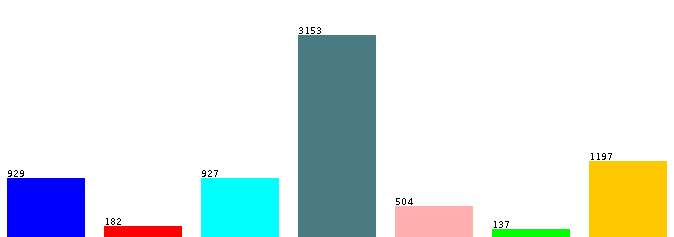

# 01 - Introduction 

At this section it will be presented the tools that are being used, the data that is being handled the workflow used to obtain the final results.

---------------------------------------

# Inspectioning the Data

Before preprocessing the data it is needed to understand it, showing its distribution and quantity over the total data. 
As it is described below the class that will be analyzed, or the final result that we want to predict, has a lot of content checked as "other", it can add some dificulty on the processing, as this may not have a specific pattern to find on the archives.

| Content Type | Quantity |
|---|:---:| 
| course | 929 | 
| department | 182 | 
| faculty | 927 | 
| other | 3153 | 
| project | 504 | 
| staff | 137 | 
| student | 1197 | 

---------------------------------------

# Tools

## Weka

Waikato Environment for Knowledge Analysis (Weka) is a suite of machine learning software written in Java, developed at the University of Waikato, New Zealand.

